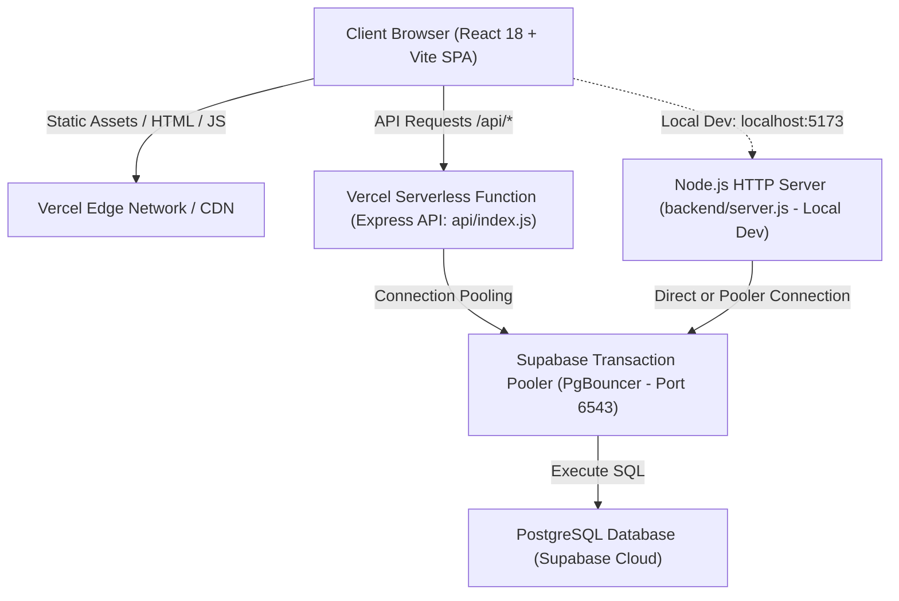

# Kiến Trúc Hệ Thống (System Architecture) - ClassManager

Tài liệu này mô tả chi tiết kiến trúc phần mềm, các tầng xử lý (layers), luồng dữ liệu (data flow) và vòng đời của một Request trong hệ thống **ClassManager**.

---

## 1. Mô Hình Tổng Thể (High-Level Architecture)

Hệ thống được thiết kế theo mô hình **Fullstack Client-Server**, triển khai theo kiến trúc lai **Serverless RESTful API & Single Page Application (SPA)**:



---

## 2. Kiến Trúc Phân Tầng Backend (Layered Backend Architecture)

Mã nguồn Backend ([backend/](file:///d:/ClassManagement/ClassManager/src)) được tổ chức nghiêm ngặt theo mô hình **Layered Architecture (Kiến trúc phân tầng)** nhằm đảm bảo tính đơn nhiệm (Single Responsibility Principle - SRP) và dễ bảo trì:

```text
HTTP Request từ Client
    │
    ▼
┌─────────────────────────────────────────────────────────────┐
│ 1. Network & Infrastructure Layer                           │
│    - CORS Whitelist Validation (backend/utils/cors.js)          │
│    - Gzip Compression (compression level 6)                 │
│    - JSON & URL-encoded Body Parsers                        │
└─────────────────────────────┬───────────────────────────────┘
                              │
                              ▼
┌─────────────────────────────────────────────────────────────┐
│ 2. Routing & Middleware Layer                               │
│    - API Router Mount (backend/app.js)                          │
│    - JWT Authentication Middleware (backend/middlewares/auth.js)│
│    - Role-Based Access Control (backend/middlewares/role.js)    │
│    - Async Handler Wrapper (backend/utils/async-handler.js)     │
└─────────────────────────────┬───────────────────────────────┘
                              │
                              ▼
┌─────────────────────────────────────────────────────────────┐
│ 3. Controller & Business Logic Layer                        │
│    - Input Validation & Normalization                       │
│    - Business Rules & Workflow Enforcement                  │
│    - Dynamic SQL Generation (backend/utils/query.js)            │
│    - Standard Response Formatter (backend/utils/response.js)    │
└─────────────────────────────┬───────────────────────────────┘
                              │
                              ▼
┌─────────────────────────────────────────────────────────────┐
│ 4. Data Access Layer                                        │
│    - PostgreSQL Connection Pool (backend/config/db.js)          │
│    - Parameterized Queries ($1, $2, ...)                    │
│    - Database Transactions (BEGIN, COMMIT, ROLLBACK)        │
└─────────────────────────────┬───────────────────────────────┘
                              │
                              ▼
┌─────────────────────────────────────────────────────────────┐
│ 5. Global Error Handling Layer                              │
│    - Not Found 404 Handler (backend/middlewares/error.js)       │
│    - Centralized Error Handler (AppError, DB error codes)   │
│    - Standardized JSON Error Output                         │
└─────────────────────────────────────────────────────────────┘
```

---

## 3. Vòng Đời Của Một Request (Request-Response Lifecycle)

Khi người dùng thực hiện một thao tác trên giao diện (ví dụ: Tạo buổi học mới `POST /api/classes/:classId/sessions`):

1. **Client Request**:
   - `frontend/src/api/client.js` tự động đính kèm `Authorization: Bearer <token>` từ `localStorage`.
2. **CORS & Headers**:
   - `app.use(cors(...))` kiểm tra origin của request (`isOriginAllowed` trong [backend/utils/cors.js](file:///d:/ClassManagement/ClassManager/backend/utils/cors.js)).
   - Request vượt qua bộ giải nén `compression` và `express.json()`.
3. **Authentication & Authorization**:
   - `requireAuth` ([backend/middlewares/auth.middleware.js](file:///d:/ClassManagement/ClassManager/backend/middlewares/auth.middleware.js)) trích xuất JWT, giải mã bằng `JWT_SECRET`, truy vấn CSDL để lấy quyền hiện tại của User (`req.user`).
   - `requireRole(['admin', 'teacher'])` ([backend/middlewares/role.middleware.js](file:///d:/ClassManagement/ClassManager/backend/middlewares/role.middleware.js)) xác thực vai trò. Nếu không hợp lệ, lập tức trả về `403 Forbidden`.
4. **Controller Execution**:
   - Controller ([backend/controllers/session.controller.js](file:///d:/ClassManagement/ClassManager/backend/controllers/session.controller.js)) kiểm tra logic nghiệp vụ: Lớp học có tồn tại không? Giáo viên này có phụ trách lớp này không?
5. **Database Interaction**:
   - Controller mở transaction qua `client = await pool.connect()`:
     - `await client.query('BEGIN')`
     - Chạy truy vấn với tham số an toàn: `INSERT INTO sessions ... VALUES ($1, $2, $3)`
     - `await client.query('COMMIT')`
   - Giải phóng client: `client.release()`.
6. **Response Formulation**:
   - Controller gọi helper `success(res, data, 'Session created successfully', 201)`.
   - Client nhận được payload JSON chuẩn: `{ "success": true, "message": "...", "data": {...} }`.

---

## 4. Cấu Trúc Frontend (Client-Side Architecture)

Frontend được xây dựng bằng **React 18 + Vite** theo chuẩn Single Page Application:

- **State Management**:
  - `AuthContext` ([frontend/src/auth/AuthContext.jsx](file:///d:/ClassManagement/ClassManager/frontend/src/auth/AuthContext.jsx)): Quản lý phiên làm việc người dùng toàn cục, đăng nhập, Google OAuth và phân quyền routing.
- **Routing & Route Protection**:
  - `ProtectedRoute` ([frontend/src/auth/ProtectedRoute.jsx](file:///d:/ClassManagement/ClassManager/frontend/src/auth/ProtectedRoute.jsx)): Tự động điều hướng người dùng chưa đăng nhập về `/login`, kiểm tra `allowedRoles` để chặn truy cập trái phép ở cấp độ giao diện.
  - `App.jsx` ([frontend/src/App.jsx](file:///d:/ClassManagement/ClassManager/frontend/src/App.jsx)): Áp dụng **Code Splitting (React.lazy + Suspense)** cho toàn bộ trang để giảm kích thước bundle ban đầu.
- **API Client Layer**:
  - `client.js` ([frontend/src/api/client.js](file:///d:/ClassManagement/ClassManager/frontend/src/api/client.js)): Tích hợp cơ chế In-Flight Request Deduplication, Client-side Caching (TTL 30s) cho các request `GET` lặp lại, và Timeout AbortController.
